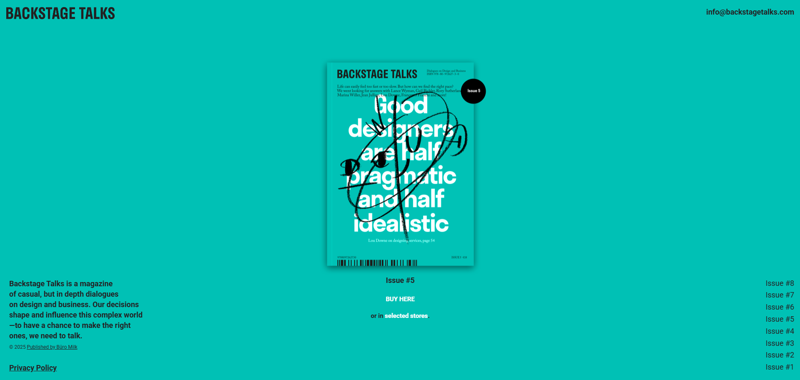

# 🎙️ Backstage Talks Clone

A responsive **Backstage Talks** magazine website clone built with **React**, **Vite**, and **Tailwind CSS**.  
This project replicates the clean, colorful design of [Backstage Talks](https://backstagetalks.com/#issue1) — a magazine about design and business — using modern front-end tools.

---

## 🌐 Live Demo
👉 [Visit the official Backstage Talks website](https://backstagetalks.com/#issue1)

*(You can replace this with your own live demo link once deployed!)*

---

## 🖥️ Tech Stack

- ⚛️ **React** — Component-based UI library  
- ⚡ **Vite** — Fast build tool for modern web apps  
- 🎨 **Tailwind CSS** — Utility-first CSS framework for styling  

---

## 🎨 Color Palette (Book Covers)

Each color below represents the **cover color of a Backstage Talks issue**.

| Issue | Color | Hex Code |
|:------|:------|:----------|
| Issue  | Teal | `#00c1b5` |
| Issue  | Orange | `#ff651a` |
| Issue  | Yellow | `#ffbe00` |
| Issue  | Blue | `#1d3fbb` |
| Issue  | Red | `#e30512` |
